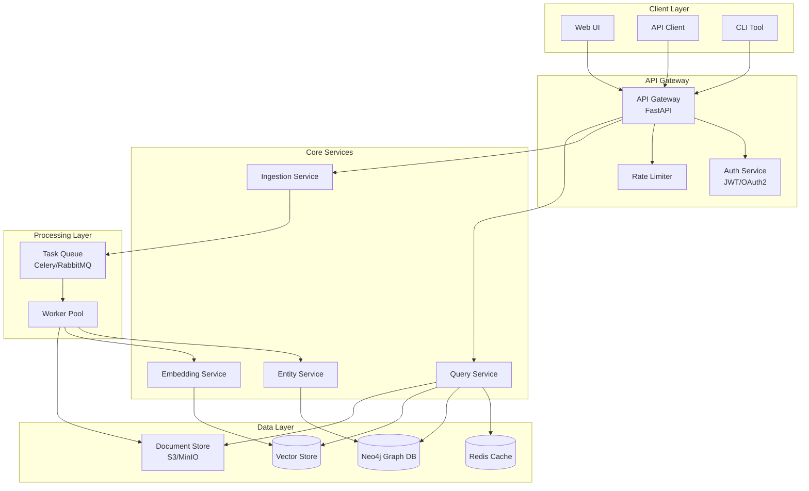
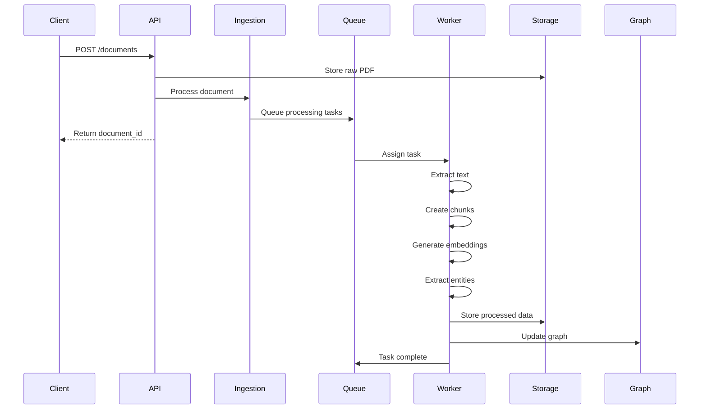
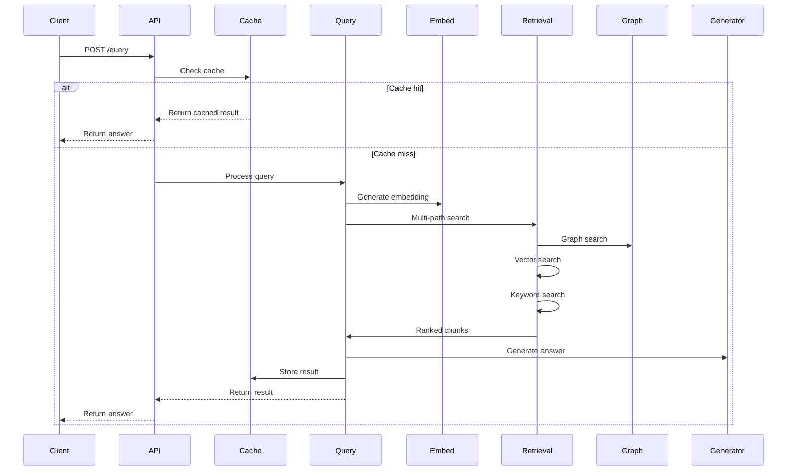
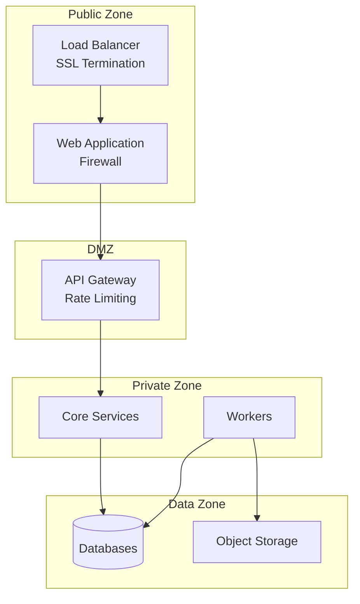

# Graph RAG System Architecture

## 1. System Overview

The Graph RAG system is designed as a microservices architecture with clear separation of concerns, enabling independent scaling and deployment of components.



## 2. Component Architecture

### 2.1 API Gateway Layer

#### Component: API Gateway
- **Technology**: FastAPI with Pydantic
- **Responsibilities**:
  - Request routing and validation
  - Authentication/authorization
  - Rate limiting and throttling
  - API versioning
  - Request/response transformation
  - Error handling and logging

#### Component: Authentication Service
- **Technology**: JWT with refresh tokens
- **Features**:
  - OAuth2 support for enterprise SSO
  - API key management
  - Role-based access control (RBAC)
  - Token refresh mechanism
  - Audit logging

### 2.2 Core Services Layer

#### Component: Ingestion Service
```python
class IngestionService:
    """Handles document processing pipeline"""
    
    async def ingest_document(self, document: UploadedFile) -> DocumentID:
        # 1. Validate document
        # 2. Store in document store
        # 3. Queue for processing
        # 4. Return tracking ID
```

**Responsibilities**:
- Document validation and storage
- Async task queuing
- Processing status tracking
- Batch ingestion support

#### Component: Query Service
```python
class QueryService:
    """Handles query processing and retrieval"""
    
    async def process_query(self, query: Query) -> QueryResult:
        # 1. Check cache
        # 2. Generate embedding
        # 3. Multi-path retrieval
        # 4. Generate answer
        # 5. Cache result
```

**Responsibilities**:
- Query preprocessing
- Cache management
- Retrieval orchestration
- Answer generation
- Result ranking

#### Component: Entity Service
```python
class EntityService:
    """Manages entity extraction and normalization"""
    
    def extract_entities(self, text: str) -> List[Entity]:
        # 1. Apply NER models
        # 2. Normalize entities
        # 3. Link to knowledge base
        # 4. Return structured entities
```

**Responsibilities**:
- Financial entity recognition
- Entity normalization
- Relationship extraction
- Entity linking

#### Component: Embedding Service
```python
class EmbeddingService:
    """Generates and manages embeddings"""
    
    def generate_embeddings(self, texts: List[str]) -> np.ndarray:
        # 1. Batch text processing
        # 2. Generate embeddings
        # 3. Normalize vectors
        # 4. Return embeddings
```

**Responsibilities**:
- Text embedding generation
- Batch processing optimization
- Model management
- GPU utilization

### 2.3 Data Layer Architecture

#### Component: Neo4j Graph Database
**Schema Design**:
```cypher
// Node Types
(:Document {
    id: String,
    filename: String,
    upload_date: DateTime,
    page_count: Integer,
    institution: String,
    product_type: String
})

(:Chunk {
    id: String,
    document_id: String,
    text: String,
    page_num: Integer,
    chunk_index: Integer,
    embedding: List<Float>
})

(:Entity {
    id: String,
    name: String,
    type: String,
    normalized_form: String
})

(:Product {
    id: String,
    name: String,
    category: String,
    institution: String
})

// Relationships
(Document)-[:HAS_CHUNK]->(Chunk)
(Chunk)-[:CONTAINS_ENTITY]->(Entity)
(Document)-[:DESCRIBES]->(Product)
(Entity)-[:RELATED_TO]->(Entity)
(Chunk)-[:SIMILAR_TO {score: Float}]->(Chunk)
```

**Indexes**:
```cypher
CREATE INDEX chunk_embedding_index FOR (c:Chunk) ON (c.embedding)
CREATE INDEX entity_name_index FOR (e:Entity) ON (e.name)
CREATE INDEX entity_type_index FOR (e:Entity) ON (e.type)
CREATE CONSTRAINT document_id_unique ON (d:Document) ASSERT d.id IS UNIQUE
```

#### Component: Vector Store
- **Technology**: Faiss or Weaviate
- **Features**:
  - High-performance similarity search
  - GPU acceleration support
  - Distributed indexing
  - Incremental updates

#### Component: Document Store
- **Technology**: S3-compatible object storage
- **Structure**:
```
/documents
  /raw
    /{year}/{month}/{day}/{document_id}.pdf
  /processed
    /{document_id}/
      metadata.json
      chunks.json
      entities.json
```

#### Component: Cache Layer
- **Technology**: Redis with persistence
- **Caching Strategy**:
  - Query results (TTL: 1 hour)
  - Embeddings (TTL: 24 hours)
  - Entity extractions (TTL: 7 days)
  - Document metadata (TTL: 30 days)

### 2.4 Processing Layer

#### Component: Task Queue
- **Technology**: Celery with RabbitMQ
- **Queue Design**:
```python
# High priority queue for queries
query_queue = Queue('queries', priority=10)

# Normal priority for ingestion
ingestion_queue = Queue('ingestion', priority=5)

# Low priority for batch operations
batch_queue = Queue('batch', priority=1)
```

#### Component: Worker Pool
- **Scaling Strategy**:
  - CPU workers for text processing
  - GPU workers for embeddings
  - Auto-scaling based on queue depth
  - Spot instance support

## 3. Data Flow Architecture

### 3.1 Document Ingestion Flow



### 3.2 Query Processing Flow



## 4. Deployment Architecture

### 4.1 Container Architecture

```yaml
# docker-compose.yml
version: '3.8'

services:
  api:
    build: ./services/api
    environment:
      - NEO4J_URI=bolt://neo4j:7687
      - REDIS_URL=redis://redis:6379
      - EMBEDDING_MODEL=BAAI/bge-small-en-v1.5
    depends_on:
      - neo4j
      - redis
    ports:
      - "8000:8000"
    deploy:
      replicas: 3
      resources:
        limits:
          cpus: '2'
          memory: 4G

  worker:
    build: ./services/worker
    environment:
      - CELERY_BROKER=amqp://rabbitmq:5672
      - GPU_ENABLED=true
    depends_on:
      - rabbitmq
      - neo4j
    deploy:
      replicas: 5
      resources:
        limits:
          cpus: '4'
          memory: 8G
        reservations:
          devices:
            - capabilities: [gpu]

  neo4j:
    image: neo4j:5-enterprise
    environment:
      - NEO4J_AUTH=neo4j/password
      - NEO4J_PLUGINS=["apoc", "graph-data-science"]
    volumes:
      - neo4j_data:/data
      - neo4j_logs:/logs
    ports:
      - "7474:7474"
      - "7687:7687"

  redis:
    image: redis:7-alpine
    command: redis-server --appendonly yes
    volumes:
      - redis_data:/data

  rabbitmq:
    image: rabbitmq:3-management
    environment:
      - RABBITMQ_DEFAULT_USER=admin
      - RABBITMQ_DEFAULT_PASS=password
    ports:
      - "15672:15672"
```

### 4.2 Kubernetes Architecture

```yaml
# k8s/deployment.yaml
apiVersion: apps/v1
kind: Deployment
metadata:
  name: graphrag-api
spec:
  replicas: 3
  selector:
    matchLabels:
      app: graphrag-api
  template:
    metadata:
      labels:
        app: graphrag-api
    spec:
      containers:
      - name: api
        image: graphrag/api:latest
        resources:
          requests:
            memory: "2Gi"
            cpu: "1"
          limits:
            memory: "4Gi"
            cpu: "2"
        env:
        - name: NEO4J_URI
          valueFrom:
            secretKeyRef:
              name: graphrag-secrets
              key: neo4j-uri
---
apiVersion: v1
kind: Service
metadata:
  name: graphrag-api
spec:
  selector:
    app: graphrag-api
  ports:
  - port: 80
    targetPort: 8000
  type: LoadBalancer
---
apiVersion: autoscaling/v2
kind: HorizontalPodAutoscaler
metadata:
  name: graphrag-api-hpa
spec:
  scaleTargetRef:
    apiVersion: apps/v1
    kind: Deployment
    name: graphrag-api
  minReplicas: 3
  maxReplicas: 10
  metrics:
  - type: Resource
    resource:
      name: cpu
      target:
        type: Utilization
        averageUtilization: 70
  - type: Resource
    resource:
      name: memory
      target:
        type: Utilization
        averageUtilization: 80
```

## 5. Security Architecture

### 5.1 Network Security


### 5.2 Data Security
- **Encryption at Rest**: AES-256 for all stored data
- **Encryption in Transit**: TLS 1.3 for all connections
- **Key Management**: AWS KMS or HashiCorp Vault
- **Access Control**: Fine-grained RBAC with audit logging

### 5.3 API Security
- **Authentication**: JWT with short-lived tokens
- **Authorization**: OAuth2 with scopes
- **Rate Limiting**: Per-user and per-IP limits
- **Input Validation**: Strict schema validation
- **CORS**: Configurable allowed origins

## 6. Monitoring Architecture

### 6.1 Observability Stack
```yaml
# monitoring/docker-compose.yml
services:
  prometheus:
    image: prom/prometheus
    volumes:
      - ./prometheus.yml:/etc/prometheus/prometheus.yml
    ports:
      - "9090:9090"

  grafana:
    image: grafana/grafana
    environment:
      - GF_SECURITY_ADMIN_PASSWORD=admin
    ports:
      - "3000:3000"

  loki:
    image: grafana/loki
    ports:
      - "3100:3100"

  tempo:
    image: grafana/tempo
    ports:
      - "3200:3200"
```

### 6.2 Metrics Collection
- **Application Metrics**: Custom metrics via Prometheus
- **Infrastructure Metrics**: Node Exporter, cAdvisor
- **Database Metrics**: Neo4j metrics plugin
- **Business Metrics**: Query accuracy, response times

### 6.3 Logging Strategy
- **Structured Logging**: JSON format with correlation IDs
- **Log Aggregation**: Centralized via Loki
- **Log Retention**: 30 days hot, 1 year cold storage
- **Alert Rules**: Automated alerting via AlertManager

## 7. Scalability Architecture

### 7.1 Horizontal Scaling
- **API Layer**: Auto-scaling based on CPU/memory
- **Worker Layer**: Queue-based scaling
- **Database Layer**: Neo4j causal clustering
- **Cache Layer**: Redis cluster mode

### 7.2 Performance Optimization
- **Query Caching**: Multi-level caching strategy
- **Embedding Cache**: Pre-computed embeddings
- **Connection Pooling**: Database connection pools
- **Batch Processing**: Efficient batch operations

### 7.3 Load Distribution
- **Geographic Distribution**: Multi-region deployment
- **CDN Integration**: Static asset caching
- **Read Replicas**: Separate read/write paths
- **Queue Partitioning**: Topic-based partitioning

## 8. Disaster Recovery

### 8.1 Backup Strategy
- **Database Backups**: Daily full, hourly incremental
- **Document Store**: S3 versioning and replication
- **Configuration**: GitOps with version control
- **Secrets**: Encrypted backup in separate region

### 8.2 Recovery Procedures
- **RTO Target**: 1 hour
- **RPO Target**: 15 minutes
- **Failover**: Automated with health checks
- **Rollback**: Blue-green deployment support

## 9. Development Architecture

### 9.1 CI/CD Pipeline
```yaml
# .gitlab-ci.yml
stages:
  - test
  - build
  - deploy

test:
  stage: test
  script:
    - pytest tests/
    - black --check .
    - mypy src/

build:
  stage: build
  script:
    - docker build -t graphrag/api:$CI_COMMIT_SHA .
    - docker push graphrag/api:$CI_COMMIT_SHA

deploy:
  stage: deploy
  script:
    - kubectl set image deployment/graphrag-api api=graphrag/api:$CI_COMMIT_SHA
```

### 9.2 Environment Strategy
- **Development**: Local Docker Compose
- **Staging**: Kubernetes namespace
- **Production**: Multi-region Kubernetes
- **Testing**: Ephemeral environments

## 10. Integration Architecture

### 10.1 External Integrations
- **Document Sources**: SharePoint, S3, Google Drive
- **Authentication**: LDAP, SAML, OAuth providers
- **Monitoring**: Datadog, New Relic, CloudWatch
- **Notification**: Email, Slack, Teams

### 10.2 API Standards
- **REST API**: OpenAPI 3.0 specification
- **GraphQL**: Optional query interface
- **WebSocket**: Real-time updates
- **gRPC**: Internal service communication